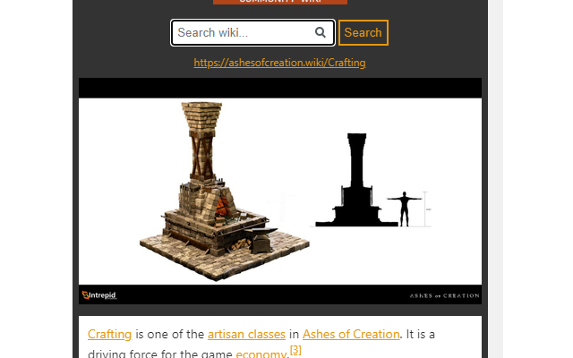

# aoc-wiki-exstension
Wiki search extension for the game Ashes of Creation. It provides an interface to https://ashesofcreation.wiki/ search functions.

Press Ctrl+Shift+S to start searching.

This started as a personal project but it seems stable enough for others to use. That said, this is very much an alpha version of the extension and I welcome contributions and bug reports.

## Installation
The extension is currently awaiting approval in the Chrome Web Store. If you want to install the extension manually simply extract [wiki_extension.zip](wiki_extension.zip) then go to chrome://extensions and hit "Load Unpacked" (top left) and select folder. Enjoy.

## Contributions
PRs and issue reports are very welcome.

### Contributors
- DakHak

This has not been officially endorsed by ashesofcreation.wiki.

## Screenshots

### Todo
- help / info menu (in progress)
- Get popovers to work (in progress)
- Options screen
- Customize shortcut keys
- Media only search
- Advanced search

### Known bugs
- ~~ Suggestions menu sticks sometimes ~~ (fixed)
- ~~ Contents button navigates to wrong index ~~ (fixed)